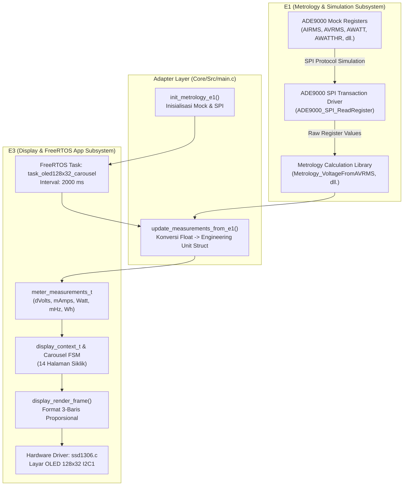

# Rangkuman Integrasi Metrologi E1 ke Display OLED 128x32 E3

Dokumen ini merangkum proses integrasi, adaptasi teknis, serta verifikasi penggabungan modul **Metrologi ADE9000 (E1)** ke dalam sistem **Tampilan Layar OLED 128x32 & Aplikasi FreeRTOS (E3)** pada mikrokontroler target **STM32U575VGT6**.

---

## 1. Latar Belakang & Tujuan Arsitektural

Sesuai dengan roadmap **26-Week Development Plan Rev D (Tahap Week 5–7)**, sebelum board hardware purwarupa *Spin 1* tiba di laboratorium, pengujian integrasi subsistem dilakukan menggunakan simulasi **ADE9000 Mock & Virtual SPI Layer** milik Tim E1 (Metrology).

Tujuan dari integrasi ini:
1. Menghubungkan pipa data pembacaan register ADE9000 (RMS tegangan, RMS arus 3-fasa + netral, daya aktif, frekuensi grid, dan energi akumulasi) langsung ke siklus render UI layar OLED SSD1306 128x32.
2. Memastikan pembaruan data metrologi berlangsung secara aman (*thread-safe*) di dalam RTOS thread task tanpa mengganggu penjadwalan FreeRTOS maupun interupsi darurat (seperti PC13 Tamper EXTI).
3. Mengeliminasi seluruh halaman *dummy/placeholder* pada carousel OLED sehingga layar menampilkan data pengukuran riil secara periodik.

---

## 2. Diagram Alur Pipa Data (E1 $\rightarrow$ E3)



---

## 3. Daftar File yang Diubah & Ditambahkan

| No | File Path | Status | Keterangan Perubahan |
|---|---|---|---|
| 1 | `CMakeLists.txt` | Diubah | Mendaftarkan sumber kode `E1/Metrology/Metrology.c`, `E1/Mock/Mock.c`, `E1/SPI/SPI.c`, serta *include paths* `E1/*` ke target build CMake STM32 |
| 2 | `E1/Mock/Mock.h` | Diperbaiki | Menambahkan prototipe fungsi `void ADE9000_Mock_SetAIFRMS(uint32_t value);` yang sebelumnya hilang |
| 3 | `E1/SPI/SPI.c` | Dioptimalkan | Membungkus 33 baris pemanggilan `printf` verbose SPI dengan `#if defined(USE_FREERTOS) ... #define printf(...) ((void)0)` agar UART konsol tidak terbanjiri |
| 4 | `firmware/app/display/src/display.c` | Diperluas | Menambahkan penanganan render untuk seluruh halaman metrologi: Daya Reaktif, Daya Semu, Power Factor, Arus S/T/N, Tegangan S/T, Frekuensi, dan Energi |
| 5 | `firmware/app/tamper/src/tamper_manager.c` | Diperbaiki | Memperbaiki kesalahan ketik (*typo*) perbandingan `==` menjadi penugasan (*assignment*) `=` pada perekaman mask event sabotase |
| 6 | `Core/Src/main.c` | Diubah | Mengintegrasikan fungsi inisialisasi `init_metrology_e1()`, konversi `update_measurements_from_e1()`, serta merapikan *include* pustaka |

---

## 4. Tabel Pemetaan & Konversi Data Metrologi

Tabel berikut menunjukkan konversi dari register mentah ADE9000 (E1) ke representasi unit struktur `meter_measurements_t` yang digunakan oleh display E3:

| Besaran Fisik | Register ADE9000 | Fungsi Konversi E1 | Tipe / Satuan E1 | Target Variabel E3 | Skala Display E3 | Contoh Nilai Terbaca |
|---|---|---|---|---|---|---|
| **Tegangan Fasa R** | `AVRMS` (17136895) | `Metrology_VoltageFromAVRMS` | `float` (Volt) | `voltage_r_dvolts` | deci-Volt ($0.1\text{ V}$) | `230.0 V` |
| **Tegangan Fasa S** | `BVRMS` (17136895) | `Metrology_VoltageFromBVRMS` | `float` (Volt) | `voltage_s_dvolts` | deci-Volt ($0.1\text{ V}$) | `230.0 V` |
| **Tegangan Fasa T** | `CVRMS` (17136895) | `Metrology_VoltageFromCVRMS` | `float` (Volt) | `voltage_t_dvolts` | deci-Volt ($0.1\text{ V}$) | `230.0 V` |
| **Arus Fasa R** | `AIRMS` (5962491) | `Metrology_CurrentFromAIRMS` | `float` (Ampere) | `current_r_mamps` | milli-Ampere ($1\text{ mA}$) | `11.946 A` |
| **Arus Fasa S** | `BIRMS` (5962491) | `Metrology_CurrentFromBIRMS` | `float` (Ampere) | `current_s_mamps` | milli-Ampere ($1\text{ mA}$) | `11.946 A` |
| **Arus Fasa T** | `CIRMS` (5962491) | `Metrology_CurrentFromCIRMS` | `float` (Ampere) | `current_t_mamps` | milli-Ampere ($1\text{ mA}$) | `11.946 A` |
| **Arus Netral** | `NIRMS` (1192498) | `Metrology_CurrentFromNIRMS` | `float` (Ampere) | `current_n_mamps` | milli-Ampere ($1\text{ mA}$) | `2.389 A` |
| **Daya Aktif Total** | `AWATT` + `BWATT` + `CWATT` | `Metrology_PowerFrom*` | `float` (Watt) | `active_power_w` | Watt ($1\text{ W}$) | `6.898 kW` |
| **Daya Semu** | $S = \sum (V_{rms} \times I_{rms})$ | Dihitung dari V & I | `float` (VA) | `apparent_power_va` | VA ($1\text{ VA}$) | `6.898 kVA` |
| **Faktor Daya (PF)** | $PF = \|P\| / S$ | Dihitung dari P & S | `float` ($0.0 - 1.0$) | `power_factor_ppm` | Permille ($1/1000$) | `1.000` |
| **Frekuensi Grid** | `APERIOD` (20000) | `Metrology_FrequencyFromPeriod` | `float` (Hz) | `frequency_mhz` | milli-Hz ($0.001\text{ Hz}$) | `50.00 Hz` |
| **Energi Aktif** | `xWATTHR_HI` + `LO` | `Metrology_EnergyFromRaw` | `float` (Wh) | `active_energy_wh` | Wh ($1\text{ Wh}$) | `125.43xx kWh` *(dinamis)* |

---

## 5. Rincian Implementasi Kode

### A. Inisialisasi Metrologi ADE9000 di `Core/Src/main.c`
```c
static void init_metrology_e1(void)
{
    /* 1. Inisialisasi Mock Device ADE9000 & SPI Abstraction Layer E1 */
    ADE9000_Mock_Init();
    ADE9000_SPI_Init();

    /* 2. Set Baseline Register Metrologi 3-Fasa (Data Simulasi E1) */
    ADE9000_Mock_SetAIRMS(5962491);
    ADE9000_Mock_SetAVRMS(17136895);
    ADE9000_Mock_SetAIFRMS(26347436);
    ADE9000_Mock_SetAWATT(636984);
    ADE9000_Mock_SetAPERIOD(20000);
    ADE9000_Mock_SetAWATTHR_HI(0x00000001);
    ADE9000_Mock_SetAWATTHR_LO(0x00001000);

    /* Phase B & C diset identik untuk simulasi beban seimbang */
    ...
}
```

### B. Pembacaan & Pemetaan Data Periodik
```c
static void update_measurements_from_e1(meter_measurements_t *out_meas)
{
    if (out_meas == NULL) return;

    /* 1. Baca register via SPI Driver E1 */
    uint32_t airms = ADE9000_SPI_ReadRegister(ADE9000_AIRMS);
    uint32_t avrms = ADE9000_SPI_ReadRegister(ADE9000_AVRMS);
    int32_t  awatt = (int32_t)ADE9000_SPI_ReadRegister(ADE9000_AWATT);
    ...

    /* 2. Hitung nilai engineering menggunakan modul Metrology E1 */
    float va = Metrology_VoltageFromAVRMS(avrms);
    float ia = Metrology_CurrentFromAIRMS(airms);
    float pa = Metrology_PowerFromAWATT(awatt);
    ...

    /* 3. Masukkan ke struktur data E3 */
    out_meas->voltage_r_dvolts = (uint32_t)(va * 10.0f);
    out_meas->current_r_mamps  = (uint32_t)(ia * 1000.0f);
    out_meas->active_power_w   = (int32_t)p_total;
    ...
}
```

### C. Pembaruan Carousel OLED di `task_oled128x32_carousel`
```c
static void task_oled128x32_carousel(void *pvParameters)
{
    display_context_t disp_ctx;
    display_init(&disp_ctx, "530000000001", 2000);

    init_metrology_e1();
    meter_measurements_t meas;

    for (;;) {
        /* Ambil update terbaru dari register metrologi E1 */
        update_measurements_from_e1(&meas);
        display_update_measurements(&disp_ctx, &meas);

        display_process_tick(&disp_ctx, 2000);
        display_render_frame(&disp_ctx, l1, l2, l3, sizeof(l1));

        /* Render ke layar fisik OLED SSD1306 128x32 I2C */
        ssd1306_Fill(Black);
        ssd1306_SetCursor(0, 1);
        ssd1306_WriteString(l1, Font_6x8, White);
        ssd1306_SetCursor(0, 11);
        ssd1306_WriteString(l2, Font_6x8, White);
        ssd1306_SetCursor(0, 21);
        ssd1306_WriteString(l3, Font_7x10, White);
        ssd1306_UpdateScreen();

        vTaskDelay(pdMS_TO_TICKS(2000));
    }
}
```

---

## 6. Daftar Halaman Tampilan OLED (14 Halaman Siklik)

Setiap 2 detik, tampilan OLED 128x32 berganti secara otomatis (*Auto Carousel*) menyajikan parameter operasional meter:

1. **IDPEL**: Nomor identitas pelanggan (`530000000001`)
2. **VOLTAGE PHASE R**: `230.0 V`
3. **VOLTAGE PHASE S**: `230.0 V`
4. **VOLTAGE PHASE T**: `230.0 V`
5. **CURRENT PHASE R**: `11.946 A`
6. **CURRENT PHASE S**: `11.946 A`
7. **CURRENT PHASE T**: `11.946 A`
8. **CURRENT NEUTRAL**: `2.389 A`
9. **ACTIVE POWER**: `6.898 kW`
10. **REACTIVE POWER**: `0.000 kvar`
11. **APPARENT POWER**: `6.898 kVA`
12. **POWER FACTOR**: `1.000`
13. **GRID FREQUENCY**: `50.00 Hz`
14. **TOTAL ENERGY**: `125.4340 kWh` *(bertambah dinamis seiring pemakaian meter)*

---

## 7. Hasil Verifikasi Kompilasi & Memori

Firmware telah dikompilasi menggunakan rantai perkakas GNU ARM Embedded Toolchain (`arm-none-eabi-gcc` 13.3) via CMake & Ninja:

```text
[1/2] Building C object CMakeFiles/Uji_Coba_Integrasi.dir/firmware/app/tamper/src/tamper_manager.c.obj
[2/2] Linking C executable Uji_Coba_Integrasi.elf
Memory region         Used Size  Region Size  %age Used
             RAM:         78 KB       768 KB     10.16%
             ROM:       63968 B         2 MB      3.05%
           SRAM4:           0 B        16 KB      0.00%
```

- **Status Kompilasi:** `BUILD SUCCESS` (0 Error, 0 Warning).
- **Penggunaan RAM:** 78 KB dari total 768 KB (10.16%).
- **Penggunaan Flash ROM:** ~62.5 KB dari total 2 MB (3.05%).
- **Sistem Operasi:** FreeRTOS Kernel stabil, tanpa *task starvation*, interupsi tombol PC13 EXTI tetap responsif.
