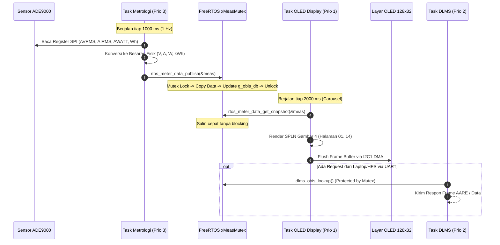

# Panduan Arsitektur & Rangkuman Sistem Smart Meter 3-Fasa (Fokus E3)

Dokumen ini disusun sebagai **panduan utama dan rangkuman komprehensif** mengenai seluruh sistem pada proyek Smart Meter 3-Fasa STM32U575VGT6, dirancang secara khusus untuk memandu **Pilar E3 (Application, UI/Display, Tamper/Security, & RTOS Orchestration Lead)** dalam memahami arsitektur, cara kerja sistem, serta tanggung jawab teknisnya.

---

## 1. Identitas Peran & Tanggung Jawab Pilar E3

Dalam pengembangan firmware Smart Meter 3-Fasa ini, **E3 memegang posisi sentral sebagai System Integrator dan Application Lead**.

```
   ┌────────────────────────────────────────────────────────┐
   │                  PERAN UTAMA PILAR E3                  │
   ├──────────────────────────┬─────────────────────────────┤
   │ 1. Display & HMI         │ Layar OLED 128x32 (SPLN G4) │
   │ 2. Tamper Event Manager  │ Keamanan & Deteksi Sabotase │
   │ 3. Profiling & Storage   │ Profil Beban 15-Mnt & NVM   │
   │ 4. RTOS Orchestrator     │ FreeRTOS Tasks, Mutex/Queue │
   └──────────────────────────┴─────────────────────────────┘
```

### Pembagian Tugas Antar Pilar Firmware:
* **E1 (Metrology Lead):** Bertanggung jawab atas IC metrologi ADE9000, transaksi SPI, kalibrasi *gain/phase*, serta kalkulasi besaran listrik ($V, I, P, Q, f, kWh$).
* **E2 (Protocol Lead):** Bertanggung jawab atas tumpukan protokol DLMS/COSEM (HDLC, APDU, AARE, pemetaan OBIS, dan pengiriman respon ke port optik UART2).
* **E3 (Anda - Application Lead):**
  1. Menyatukan data dari **E1** dan mendistribusikannya secara aman (*thread-safe*) ke **E2** dan **Layar Display**.
  2. Mengelola logika kejadian darurat dan sabotase (**Tamper Management**) dari pin fisik PC13 maupun anomali metrologi.
  3. Mengatur orkestrasi multitasking menggunakan **FreeRTOS** agar terbebas dari *race condition*, *torn-read*, atau *deadlock*.
  4. Mengontrol tampilan layar OLED SSD1306 128x32 agar **100% patuh pada Standar Layar Meter PLN (SPLN D3.006-1 Gambar 4)**.

---

## 2. Peta Berkas & Modul di Folder Proyek (Domain E3)

Semua modul yang dikelola langsung oleh E3 terletak di dalam folder [`firmware/app/`](file:///g:/PPPP/Day_Sekian/Uji_Coba_Integrasi/firmware/app/) dan [`Core/`](file:///g:/PPPP/Day_Sekian/Uji_Coba_Integrasi/Core/):

| Modul E3 | Berkas Utama | Tanggung Jawab Teknis |
| :--- | :--- | :--- |
| **Display (HMI)** | [`display.h`](file:///g:/PPPP/Day_Sekian/Uji_Coba_Integrasi/firmware/app/display/inc/display.h)<br>[`display.c`](file:///g:/PPPP/Day_Sekian/Uji_Coba_Integrasi/firmware/app/display/src/display.c) | Mengatur 14 halaman carousel tampilan meter. Memformat layout SPLN Gambar 4 (`display_spln_frame_t`), simbol status (`OK` / `!`), status baterai `[B]`, arah arus `<-`, fasa `L123 I123`, dan kode OBIS penagihan. |
| **Driver Layar OLED** | [`ssd1306.c`](file:///g:/PPPP/Day_Sekian/Uji_Coba_Integrasi/Core/Src/ssd1306.c)<br>[`ssd1306_fonts.c`](file:///g:/PPPP/Day_Sekian/Uji_Coba_Integrasi/Core/Src/ssd1306_fonts.c) | Driver perangkat keras OLED SSD1306 via I2C1 (PB8/PB9). Berisi font 6x8 (teks kecil) dan font 11x18 (angka besar 7-segment). **Sudah dilengkapi proteksi batas waktu (timeout 25ms) anti-freeze.** |
| **Tamper Manager** | [`tamper_manager.h`](file:///g:/PPPP/Day_Sekian/Uji_Coba_Integrasi/firmware/app/tamper/inc/tamper_manager.h)<br>[`tamper_manager.c`](file:///g:/PPPP/Day_Sekian/Uji_Coba_Integrasi/firmware/app/tamper/src/tamper_manager.c) | Menangani 5 vektor sabotase: Buka Tutup Meter (`CASE_OPEN`), Buka Terminal (`TERMINAL_OPEN`), Medan Magnet (`MAGNETIC_FIELD`), Arus Balik (`REVERSE_POWER`), dan Hilang Netral (`NEUTRAL_BYPASS`). |
| **RTOS Tasks & IPC** | [`rtos_tasks.h`](file:///g:/PPPP/Day_Sekian/Uji_Coba_Integrasi/firmware/app/fsm/inc/rtos_tasks.h)<br>[`rtos_tasks.c`](file:///g:/PPPP/Day_Sekian/Uji_Coba_Integrasi/firmware/app/fsm/src/rtos_tasks.c) | Jantung konkurensi sistem: inisialisasi `xMeasMutex` (Mutex proteksi memori pengukuran) dan `xTamperQueue` (Queue pesan darurat). Mengatur fungsi publish/snapshot data. |
| **Profiling & NVM** | [`load_profile.c`](file:///g:/PPPP/Day_Sekian/Uji_Coba_Integrasi/firmware/app/profiling/src/load_profile.c)<br>[`nvram_storage.c`](file:///g:/PPPP/Day_Sekian/Uji_Coba_Integrasi/firmware/app/profiling/src/nvram_storage.c) | Perekam riwayat profil beban tiap 15 menit (kapasitas 96 snapshot/hari). Menyimpan data snapshot energi dan log sabotase ke memori Flash/FRAM internal. |
| **System Startup** | [`main.c`](file:///g:/PPPP/Day_Sekian/Uji_Coba_Integrasi/Core/Src/main.c)<br>[`stm32u5xx_it.c`](file:///g:/PPPP/Day_Sekian/Uji_Coba_Integrasi/Core/Src/stm32u5xx_it.c) | Titik masuk utama program: inisialisasi clock 160 MHz, peripheral STM32U575 (I2C1, USART2 DMA, EXTI13 PC13, SPI1), startup FreeRTOS, dan interrupt handler. |

---

## 3. Cara Kerja Sistem (*System Operation*)

Sistem firmware beroperasi melalui **3 pipa aliran data (*pipelines*)**:

```
[KOLOM 1: AKUISISI / PRODUCER]       [KOLOM 2: FREERTOS THREAD-SAFE IPC]        [KOLOM 3: KONSUMSI / CONSUMER]
   
   ADE9000 (SPI1)                             xMeasMutex & OBIS DB                   task_dlms (Priority 2)
         │                                   ┌──────────────────────┐                          │
         ▼                                   │ meter_measurements_t │─────────────────────────►▼
   task_metrology (Prio 3) ─────────────────►│  (V, A, W, kWh, Hz)  │                    Port Optik UART2
   [E1 - Metrology Lead]                     └──────────┬───────────┘                     (Handheld / HES)
                                                        │
                                                        ▼
   Switch Tamper (PC13)                       xTamperQueue & Flag                     task_oled_display (Prio 1)
         │                                   ┌──────────────────────┐                          │
         ▼                                   │ tamper_event_msg_t   │─────────────────────────►▼
   task_tamper (Prio 4)    ─────────────────►│  (!ALM Event Queue)  │                    Layar OLED 128x32
   [E3 - Security Lead]                      └──────────────────────┘                     (Tampilan SPLN Gbr 4)
```

---

### A. Pipeline Normal: Pengukuran $\rightarrow$ Sinkronisasi $\rightarrow$ Tampilan



1. **Task Metrologi (E1)** membaca data mentah register ADE9000 setiap 1 detik.
2. Data dikonversi ke unit teknik (misal: deci-Volt, milli-Ampere, Watt, Wh) dan dipublikasikan via fungsi **`rtos_meter_data_publish(&meas)`**.
3. Fungsi ini mengunci `xMeasMutex`, menyalin data ke buffer global `s_latest_measurements`, dan otomatis memperbarui kamus register OBIS DLMS `g_obis_db`.
4. **Task OLED Display (E3)** bangun setiap 2 detik, memanggil **`rtos_meter_data_get_snapshot(&meas)`** untuk mengambil salinan data terbaru secara aman, lalu merender grafik dan teks ke layar OLED via bus I2C1.
5. **Task DLMS (E2)** membaca tabel OBIS di bawah proteksi mutex saat menerima *GET-Request* dari port serial optik.

---

### B. Pipeline Darurat: Deteksi Sabotase (*Tamper Pipeline*)

Saat tombol fisik PC13 ditekan atau saklar microswitch casing terbuka:

```
[Tombol PC13 / Switch Buka Tutup]
               │ (Jatuh / Falling Edge)
               ▼
[HAL_GPIO_EXTI_Falling_Callback() di main.c]
   ├─► Debounce software (250 ms)
   ├─► Set status alarm: g_tamper_alarm_active = true
   ├─► Trigger INSTAN: oled_trigger_instant_refresh() (Layar langsung berubah)
   └─► rtos_queue_send_tamper_event_from_isr(&msg)
               │ (Masuk ke FreeRTOS xTamperQueue)
               ▼
[Task DLMS : task_dlms_entry]
   ├─► Baca pesan sabotase dari antrean (rtos_queue_receive_tamper_event)
   ├─► Tambahkan ke Circular FIFO DLMS Profile Generic (0.0.99.98.0.255)
   ├─► Naikkan Counter Sabotase OBIS (0.0.96.20.1.255 & Total 0.0.96.20.0.255)
   └─► Simpan snapshot kejadian ke Flash / NVRAM
```

* **Dampak Visual pada OLED:** Simbol `OK` di sudut kiri atas layar seketika berubah menjadi tanda seru **`!`**, dan layar memunculkan banner peringatan pembalik warna (*inverted solid*) **`!ALM SABOTASE E01`**.

---

### C. Pipeline Profil Beban (*Load Profile 15-Menit*)

* Di dalam `task_metrology_profiling_entry` ([`rtos_tasks.c`](file:///g:/PPPP/Day_Sekian/Uji_Coba_Integrasi/firmware/app/fsm/src/rtos_tasks.c)), terdapat penghitung waktu independen 900 detik (15 menit).
* Setiap kali 15 menit tercapai, sistem memanggil **`load_profile_add_entry(&g_profile_mgr, &meas, timestamp)`**.
* Snapshot parameter kelistrikan ($V, I, P, PF, kWh$) dibekukan ke dalam *circular ring buffer* (kapasitas 96 entri/hari) di Flash/NVRAM untuk keperluan audit penagihan dan pembacaan DLMS Class 7.

---

## 4. Konsep Kritis yang Wajib Dipahami E3

### A. Mengapa Thread-Safety (`xMeasMutex`) Wajib Digunakan?
* Pada mikrokontroler 32-bit (seperti ARM Cortex-M33 STM32U575), variabel data energi aktif 64-bit (`uint64_t active_energy_wh`) **tidak bisa ditulis atau dibaca dalam 1 instruksi mesin tunggal** (membutuhkan 2 instruksi `STRD` atau `LDRD`).
* Jika Task OLED atau Task DLMS membaca data energi di saat Task Metrologi baru menulis 32-bit pertama lalu terinterupsi (*task preemption*), data kWh yang terbaca akan rusak parah (**Torn-Read**).
* **Aturan Mutlak untuk E3:**
  $$\text{DILARANG membaca atau menulis struct } \texttt{meter\_measurements\_t} \text{ secara langsung!}$$
  * Jika ingin menulis data $\rightarrow$ Gunakan `rtos_meter_data_publish(&meas)`.
  * Jika ingin membaca data $\rightarrow$ Gunakan `rtos_meter_data_get_snapshot(&meas)`.

---

### B. Spesifikasi Layar Standar PLN (SPLN D3.006-1 Gambar 4)

Layar OLED SSD1306 128x32 dibagi menjadi 2 area vertikal:

```
    0                    Lebar Layar = 128 Pixel                   127
  0 ┌────────────────────────────────────────────────────────────────┐
    │ OK[B] L123 I123 32.07                                          │ <- Baris 1: Simbol & Kode OBIS (Font 6x8)
 10 ├ - - - - - - - - - - - - - - - - - - - - - - - - - - - - - - -  ┤ <- Garis pemisah titik-titik (Y=10)
    │                                                                │
    │ 02               2 3 0 . 0                                   V │ <- Baris 2: zz (Font 6x8), Nilai (Font 11x18),
 31 └────────────────────────────────────────────────────────────────┘             Satuan (Font 6x8)
```

#### Tabel 14 Halaman Carousel Otomatis (Berganti Tiap 2 Detik):

| zz | Halaman Parameter | Baris 1 (Simbol & Kode) | Baris 2 (zz, Nilai Besar, Satuan) |
|---|---|---|---|
| **01** | ID Pelanggan | `OK[B] L123 I123 96.01` | `01  530000000001` |
| **02** | Tegangan Fasa R / L1 | `OK[B] L123 I123 32.07` | `02    230.0   V` |
| **03** | Tegangan Fasa S / L2 | `OK[B] L123 I123 52.07` | `03    230.0   V` |
| **04** | Tegangan Fasa T / L3 | `OK[B] L123 I123 72.07` | `04    230.0   V` |
| **05** | Arus Fasa R / L1 | `OK[B] L123 I123 31.07` | `05    11.95   A` |
| **06** | Arus Fasa S / L2 | `OK[B] L123 I123 51.07` | `06    11.95   A` |
| **07** | Arus Fasa T / L3 | `OK[B] L123 I123 71.07` | `07    11.95   A` |
| **08** | Arus Netral N | `OK[B] L123 I123 91.07` | `08     2.39   A` |
| **09** | Daya Aktif Total | `OK[B] L123 I123 01.07` | `09    6.898  kW` |
| **10** | Daya Reaktif Total | `OK[B] L123 I123 03.07` | `10    0.000  kvar` |
| **11** | Daya Semu Total | `OK[B] L123 I123 09.07` | `11    6.898  kVA` |
| **12** | Faktor Daya Total | `OK[B] L123 I123 13.07` | `12    1.000  PF` |
| **13** | Frekuensi Jaringan | `OK[B] L123 I123 14.07` | `13    50.00  Hz` |
| **14** | Total Energi Aktif | `OK[B] L123 I123 01.08` | `14   125.43  kWh` |

---

### C. Catatan Perbaikan Bug Krusial (*Lessons Learned*)

Dua bug fatal yang pernah terjadi dan berhasil diperbaiki di sistem ini wajib diketahui agar tidak terulang:

1. **Bug Freeze Hardware saat Startup (Docklight & Layar Mati Total):**
   * *Akar Masalah:* `USART2_IRQHandler` belum diimplementasikan di `stm32u5xx_it.c`. Ketika DMA UART dinyalakan di `main()`, pin RX mendeteksi IDLE line dan memicu interupsi hardware. Karena fungsinya tidak ada, CPU langsung masuk ke `Default_Handler` (loop tak hingga) sebelum scheduler FreeRTOS sempat dijalankan.
   * *Solusi:* Implementasikan fungsi `USART2_IRQHandler` dan pastikan memanggil `HAL_UART_IRQHandler(&huart2)`.
2. **Bug I2C OLED `HAL_MAX_DELAY` (Sistem Macet saat Layar Dilepas):**
   * *Akar Masalah:* Driver OLED dulunya memakai `HAL_MAX_DELAY`. Jika kabel OLED kendor atau modul rusak, CPU *hang* menunggu selamanya di dalam fungsi I2C.
   * *Solusi:* Seluruh pemanggilan I2C OLED kini diproteksi dengan batas waktu maksimal **25 ms** (`SSD1306_I2C_TIMEOUT_MS`). Jika OLED tidak merespons, fungsi langsung *return timeout* tanpa memacetkan sistem.

---

### D. Kesiapan Sistem: Pasca-Bayar vs Pra-Bayar

Arsitektur yang dibangun E3 saat ini **sudah agnostik dan siap untuk Pasca-Bayar maupun Pra-Bayar**:
* **Metrologi (E1) & Snapshot Mutex:** Tetap sama persis (mengakumulasi total $kWh$).
* **Jika Pascabayar:** Data $kWh$ ditagih periodik via DLMS / AMR.
* **Jika Prabayar:** E3 tinggal menambahkan logika pengurangan saldo pulsa:
  $$\text{Sisa Pulsa} = \text{Sisa Pulsa Sebelumnya} - \Delta kWh$$
  dan memicu relai pemutus (*contactor trip*) jika sisa pulsa $\le 0$.

---

## 5. Panduan Praktis Verifikasi & Uji Mandiri untuk E3

Untuk memverifikasi modul E3 secara mandiri di workstation:

1. **Uji Kompilasi & Host Unit Test (CTest):**
   ```bash
   ./tests/test_e3_app.exe
   ./tests/test_spln_display_tamper.exe
   ```
   *Memastikan state machine FSM, format rendering Gambar 4, dan queue tamper berjalan 100% lulus.*

2. **Uji Integrasi End-to-End E1 ke E2:**
   ```bash
   ./tests/test_e1_to_e2_integration.exe
   ```
   *Memverifikasi data pembacaan sensor ADE9000 dari E1 berhasil masuk ke OBIS DLMS E2 via mutex IPC E3.*

3. **Uji Hardware STM32U575:**
   * Flash firmware `Uji_Coba_Integrasi.elf` via ST-Link.
   * Hubungkan kabel serial USB-to-UART ke PA2/PA3 @ 115200 bps untuk melihat log monitor.
   * Tekan tombol PC13 untuk menguji respons instan sabotase pada layar OLED SSD1306.

