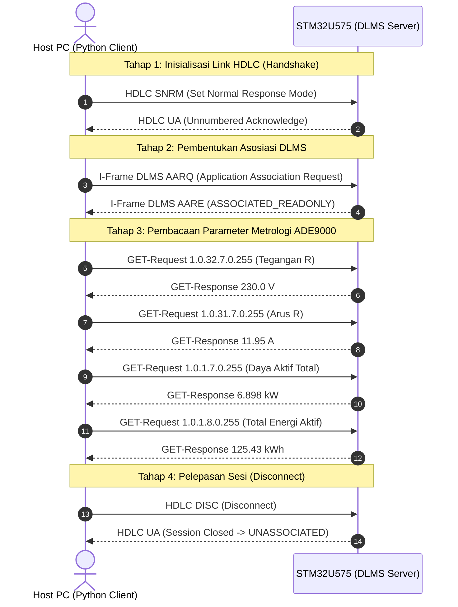

# Panduan & Prosedur Pengujian Komunikasi DLMS/COSEM via UART

Dokumen ini memandu langkah verifikasi komunikasi serial protokol **DLMS/COSEM HDLC (IEC 62056-46 / SPLN D3.022-1)** antara Host PC Client dan **Smart Meter 3-Fasa STM32U575**.

---

## 1. Arsitektur Komunikasi UART

| Komponen | Spesifikasi & Konfigurasi |
| :--- | :--- |
| **Port Serial** | `USART2` (PA2: TX, PA3: RX) via Converter Serial (misal CH340 `COM27`) |
| **Baud Rate** | `115200 bps`, 8 Data Bits, No Parity, 1 Stop Bit (8N1) |
| **Transmisi MCU** | Interrupt-Driven DMA RxEvent (`HAL_UARTEx_ReceiveToIdle_DMA`) & Ring Buffer FreeRTOS |
| **Protokol Lapisan Fisik / Data Link** | HDLC Flag (`0x7E`), HCS & FCS CRC16-CCITT (Polinomial `0x8408`) |
| **Lapisan Aplikasi** | DLMS/COSEM xDLMS (AARQ, AARE, GET-Request, GET-Response, DISC) |
| **Logical Device / Server SAP** | `0x01` (Management Logical Device) |
| **Client SAP** | `0x10` (Public Client / Read-Only Association) |

---

## 2. Alur Pengujian 4 Tahap (State Transition)



---

## 3. Daftar Register OBIS yang Diuji

| Parameter Metrologi | Objek OBIS | Class ID | Attr | Skala | Satuan | Nilai Terbaca |
| :--- | :--- | :---: | :---: | :---: | :---: | :---: |
| **Tegangan Fasa R** | `1.0.32.7.0.255` | 3 | 2 | `0.1` | V | `230.0 V` |
| **Tegangan Fasa S** | `1.0.52.7.0.255` | 3 | 2 | `0.1` | V | `230.0 V` |
| **Tegangan Fasa T** | `1.0.72.7.0.255` | 3 | 2 | `0.1` | V | `230.0 V` |
| **Arus Fasa R** | `1.0.31.7.0.255` | 3 | 2 | `0.01` | A | `11.95 A` |
| **Arus Fasa S** | `1.0.51.7.0.255` | 3 | 2 | `0.01` | A | `11.95 A` |
| **Arus Fasa T** | `1.0.71.7.0.255` | 3 | 2 | `0.01` | A | `11.95 A` |
| **Arus Netral N** | `1.0.91.7.0.255` | 3 | 2 | `0.01` | A | `2.39 A` |
| **Daya Aktif Total** | `1.0.1.7.0.255` | 3 | 2 | `0.001` | kW | `6.898 kW` |
| **Total Energi Aktif** | `1.0.1.8.0.255` | 3 | 2 | `0.01` | kWh | `125.43 kWh` |

---

## 4. Langkah Menjalankan Pengujian

### Langkah 1: Flash Firmware Terbaru ke STM32
File biner ELF telah selesai dikompilasi dengan pembaruan interupsi USART2 IDLE line dan binding DLMS task:
- Path Biner: `build/Debug/Uji_Coba_Integrasi.elf`

Flash menggunakan IDE / ST-Link programmer yang biasa digunakan.

### Langkah 2: Tutup / Disconnect Serial Monitor di Host PC
> [!IMPORTANT]
> Port serial `COM27` (atau converter yang terhubung ke pin PA2/PA3) saat ini mungkin masih terkunci oleh aplikasi serial monitor (seperti PuTTY, Tera Term, VS Code Serial Monitor, Hercules, atau CubeIDE Console). 
> **Harap tutup/disconnect terminal tersebut terlebih dahulu** agar skrip pengujian dapat membuka port `COM27`.

### Langkah 3: Eksekusi Skrip Uji Python
Jalankan perintah berikut di terminal:
```powershell
python tools/test_dlms_uart.py COM27 115200
```

*(Jika ingin mencoba simulasi tanpa board fisik, jalankan `python tools/test_dlms_uart.py --mock`)*.
