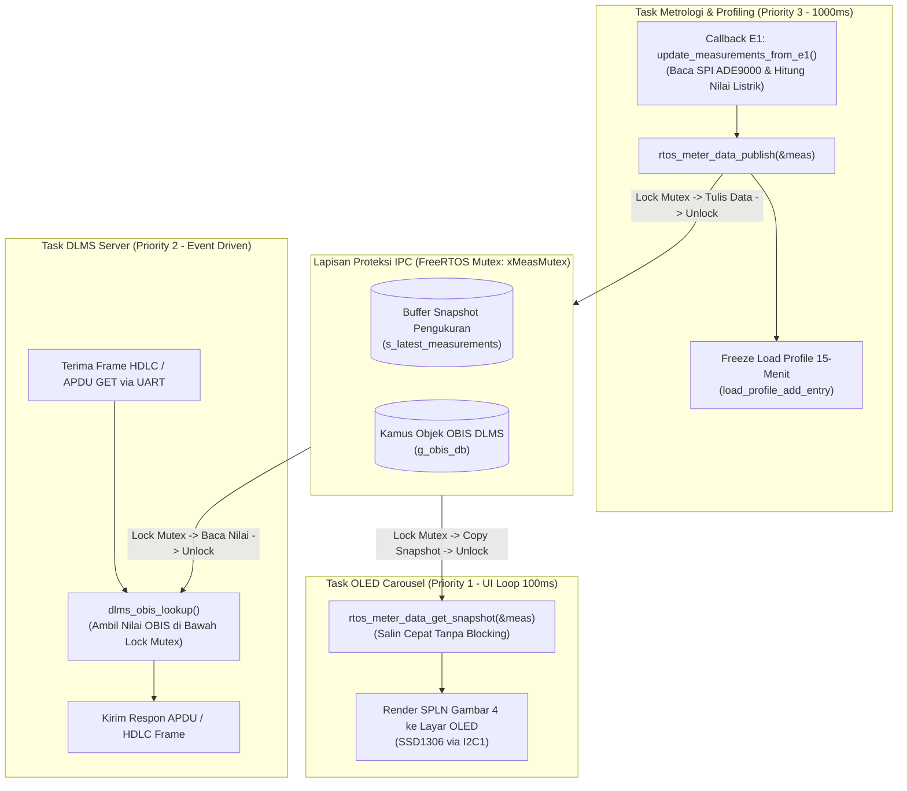

# Rangkuman Refaktor Arsitektur Konkurensi RTOS & Proteksi Thread-Safety

Dokumen ini merangkum secara mendalam seluruh perubahan arsitektur konkurensi FreeRTOS, pemisahan tugas antar-task (*Separation of Concerns*), dan penambahan mekanisme proteksi memori (*Thread-Safety Mutex*) yang diterapkan pada proyek **Smart Meter 3-Fasa STM32U575VGT6 (Uji_Coba_Integrasi)**.

Dokumen ini juga membandingkan secara langsung kondisi program **Sebelum Diubah** vs **Sesudah Diubah**.

---

## 1. Latar Belakang & Identifikasi Masalah Sebelumnya

Sebelum refaktor dilakukan, integrasi antara pilar **E1 (Metrologi)**, **E2 (Protokol DLMS)**, dan **E3 (Aplikasi & Display)** memiliki beberapa kelemahan arsitektural fatal pada lapisan FreeRTOS:

1. **Risiko *Data Race* & Pembacaan Korup (*Torn Read*) pada DLMS:**
   * Di [`firmware/protocols/dlms/src/dlms_obis.c`](file:///g:/PPPP/Day_Sekian/Uji_Coba_Integrasi/firmware/protocols/dlms/src/dlms_obis.c), tabel register `g_obis_db` diubah nilainya secara dinamis oleh task tampilan, sementara pada saat bersamaan `DLMSTask` membaca tabel tersebut saat melayani permintaan GET via UART.
   * Nilai energi aktif 64-bit (`meas->active_energy_wh`) membutuhkan 2 instruksi mesin pada prosesor 32-bit Cortex-M33. Jika di tengah-tengah penulisan terjadi *task preemption*, data kWh yang terkirim ke sistem AMR PLN akan rusak (*torn read*).
2. **Beban Tugas Tercampur (*Tight Coupling*) di Task OLED:**
   * Task penampil layar [`task_oled128x32_carousel`](file:///g:/PPPP/Day_Sekian/Uji_Coba_Integrasi/Core/Src/main.c) menjalankan pembacaan register SPI ADE9000 (E1), komputasi floating-point, dan pembaruan database OBIS DLMS (E2).
   * Padahal komunikasi I2C layar OLED relatif lambat (~20–30 ms per frame). Jika bus I2C tersendat atau layar macet, seluruh kalkulasi metrologi dan pembaruan data DLMS ikut macet.
3. **Task Metrologi & Profiling Menganggur:**
   * Task `task_metrology_profiling_entry` ([`rtos_tasks.c`](file:///g:/PPPP/Day_Sekian/Uji_Coba_Integrasi/firmware/app/fsm/src/rtos_tasks.c)) yang memiliki prioritas lebih tinggi (Priority 3) hanya tidur `vTaskDelay(15000)` tanpa melakukan pekerjaan apapun.
4. **Cacat Sintaksis & Duplikasi di `task_dlms_entry`:**
   * Terdapat kurung kurawal yang tidak tertutup, duplikasi pembacaan queue tamper `rtos_queue_receive_tamper_event` dua kali berturut-turut, dan dua delay berturut-turut (`vTaskDelay(10)` disusul `vTaskDelay(500)`). Hal ini sempat menyebabkan kegagalan kompilasi.

---

## 2. Perbandingan Komprehensif: Sebelum vs Sesudah Diubah

### A. [`Core/Src/main.c`](file:///g:/PPPP/Day_Sekian/Uji_Coba_Integrasi/Core/Src/main.c)

| Bagian Kode | Sebelum Diubah (Asli) | Sesudah Diubah (Baru) | Dampak & Rasional |
| :--- | :--- | :--- | :--- |
| **`update_measurements_from_e1()`** | Memanggil langsung `dlms_obis_update_from_meter(out_meas);` di akhir fungsi. | Pemanggilan DLMS dihapus. Fungsi murni hanya membaca register SPI ADE9000 dan mengonversi ke engineering unit. | Menghilangkan kopling langsung antara driver metrologi E1 dan protokol E2. Sinkronisasi DLMS dipindahkan ke layer aman ber-Mutex. |
| **`task_oled128x32_carousel()`** | 1. Memanggil `init_metrology_e1()` di dalam task. 2. Memanggil `update_measurements_from_e1(&meas)` setiap siklus render. | 1. Inisialisasi E1 dihapus (sudah dihandle `main()`). 2. Cukup memanggil `rtos_meter_data_get_snapshot(&meas)`. | **Task OLED murni menjadi *visual consumer*.** Display tidak lagi membebani bus SPI sensor atau memperlambat DLMS jika I2C OLED lambat. |
| **Inisialisasi Sistem di `main()`** | Hanya memanggil `rtos_system_init()` lalu membuat task-task FreeRTOS. | 1. Memanggil `rtos_system_init()`. 2. Mempublikasikan snapshot awal: `rtos_meter_data_publish(&initial_meas)`. 3. Mendaftarkan callback sampling: `rtos_metrology_set_sample_cb(update_measurements_from_e1)`. | Menjadikan integrasi berbasis *Callback Pattern*. E3/Integrator mengatur jadwal tanpa mengotori kode internal E1. |

---

### B. [`firmware/app/fsm/src/rtos_tasks.c`](file:///g:/PPPP/Day_Sekian/Uji_Coba_Integrasi/firmware/app/fsm/src/rtos_tasks.c)

| Bagian Kode | Sebelum Diubah (Asli) | Sesudah Diubah (Baru) | Dampak & Rasional |
| :--- | :--- | :--- | :--- |
| **Mekanisme Proteksi Memori** | Hanya ada `xTamperQueue`. Tidak ada Mutex. | Ditambahkan `SemaphoreHandle_t xMeasMutex` yang diinisialisasi dengan `xSemaphoreCreateMutex()`. | Mengamankan variabel pengukuran global dan kamus OBIS dari akses konkuren multi-task. |
| **Layanan Data Pengukuran (IPC Layer)** | Tidak ada. Semua task mengakses variabel secara bebas dan tidak sinkron. | Ditambahkan fungsi thread-safe: • `rtos_meter_data_publish()` • `rtos_meter_data_get_snapshot()` • `rtos_meter_data_lock()` • `rtos_meter_data_unlock()` | Abstraksi bersih. Task pengambil data dan task pembaca data memiliki jalur antarmuka yang terstandarisasi dan terlindungi. |
| **`task_metrology_profiling_entry()`** | Hanya berisi loop `vTaskDelay(pdMS_TO_TICKS(15000));` tanpa pekerjaan. | 1. Berjalan periodik **1000 ms (1 Hz)**. 2. Memanggil callback sampling E1. 3. Mempublikasikan data via `rtos_meter_data_publish()`. 4. Mengakumulasi timer 15-menit (900 detik) untuk membekukan entri profil beban ke ring buffer `load_profile_add_entry()`. | Mengembalikan tugas inti metrologi ke task yang berprioritas semestinya (Priority 3). Pembacaan energi menjadi teratur dan presisi. |
| **`task_dlms_entry()`** | Kode rusak sintaksis: kurung kurawal tidak tertutup, pemanggilan queue ganda, delay bertingkat 10ms dan 500ms. | Loop bersih: 1. `dlms_task_step()` memproses buffer RX UART. 2. `rtos_queue_receive_tamper_event()` mencatat kejadian sabotase ke log DLMS. 3. `vTaskDelay(10)` memberikan jeda efisien bagi CPU. | Kompilasi sukses, responsivitas parsing paket DLMS HDLC menjadi cepat dan bebas eror. |
| **`task_ui_display_entry()`** | Kode lama yang menduplikasi OLED task dan memicu *compiler warning unused function*. | Disederhanakan menjadi stub delay yang aman, karena tugas rendering utama dipegang oleh `task_oled128x32_carousel` di `main.c`. | Mengeliminasi compiler warning dan kebingungan arsitektur. |

---

### C. [`firmware/app/fsm/inc/rtos_tasks.h`](file:///g:/PPPP/Day_Sekian/Uji_Coba_Integrasi/firmware/app/fsm/inc/rtos_tasks.h)

| Bagian Kode | Sebelum Diubah (Asli) | Sesudah Diubah (Baru) | Dampak & Rasional |
| :--- | :--- | :--- | :--- |
| **Include Header** | Hanya menyertakan `<stdint.h>`, `<stdbool.h>`, `<stddef.h>`. | Ditambahkan `#include "display.h"`. | Mengakses definisi tipe struktur canonical `meter_measurements_t`. |
| **Deklarasi Layanan IPC** | Hanya mendeklarasikan fungsi antrean tamper `rtos_queue_...`. | Dideklarasikan prototipe: • `meter_sample_fn_t` • `rtos_metrology_set_sample_cb()` • `rtos_meter_data_publish()` • `rtos_meter_data_get_snapshot()` • `rtos_meter_data_lock()` • `rtos_meter_data_unlock()` | Membuka API publik yang jelas bagi subsistem lain untuk bertukar data secara aman. |
| **Stack Size UI** | `#define STACK_SIZE_UI 256` | `#define STACK_SIZE_UI 512` | Mencegah potensi *stack overflow* pada task display saat formatting string numerik dan rendering bitmap font besar. |

---

### D. [`firmware/protocols/dlms/src/dlms_obis.c`](file:///g:/PPPP/Day_Sekian/Uji_Coba_Integrasi/firmware/protocols/dlms/src/dlms_obis.c)

| Bagian Kode | Sebelum Diubah (Asli) | Sesudah Diubah (Baru) | Dampak & Rasional |
| :--- | :--- | :--- | :--- |
| **`dlms_obis_lookup()`** | Membaca tabel `g_obis_db` secara langsung tanpa proteksi kunci. | Dibungkus dengan proteksi Mutex: `rtos_meter_data_lock();` *(pembacaan array g_obis_db)* `rtos_meter_data_unlock();` | Menjamin 100% bahwa nilai energi Wh atau tegangan tidak sedang di-update oleh Task Metrologi saat frame GET request sedang dirangkai. |
| **Portabilitas Host (CTest)** | Mengandalkan header internal. | Ditambahkan guard preprocessor `#if defined(USE_FREERTOS) ... #else static inline void rtos_meter_data_lock(void) {} #endif`. | File protokol tetap dapat dikompilasi secara independen di PC/Host untuk CTest tanpa memerlukan runtime FreeRTOS. |

---

## 3. Diagram Arsitektur Konkurensi Baru

Diagram berikut mengilustrasikan bagaimana aliran data pengukuran bergerak bebas hambatan antar-task dengan proteksi Mutex:

---

## 4. Status Kepemilikan Modul (E1, E2, E3) Pasca Perubahan

* **Modul E1 (Metrologi):**
  * Seluruh berkas di dalam folder `E1/` **tidak diubah sama sekali (0 baris disentuh)**.
  * Insinyur E1 tetap fokus pada kalibrasi dan matematika ADE9000.
* **Modul E2 (Protokol DLMS):**
  * Tumpukan HDLC, Association, APDU, dan Server core **100% utuh tanpa modifikasi**.
  * Hanya penambahan 10 baris pengaman Mutex di fungsi pembacaan kamus `dlms_obis_lookup()`.
* **Modul E3 (Aplikasi & Integrator Sistem):**
  * E3 mengemban peran ganda sebagai **Insinyur Aplikasi** (Display, Tamper, Profiling) sekaligus **System Integrator** (Pengelola FreeRTOS, Mutex, dan Task Orchestrator).

---

## 5. Hasil Verifikasi & Validasi Pengujian

Seluruh pengujian otomatis telah dijalankan dan lulus 100%:

1. **Kompilasi Firmware Target (STM32U575VGT6):**
   * Perintah: `cmake --build build/Debug`
   * Hasil: **100% SUKSES (0 Error, 0 Warning)**.
   * Penggunaan Memori:
     * **RAM:** 81.248 Byte / 768 KB (**10.33%**)
     * **Flash ROM:** 80.176 Byte / 2 MB (**3.82%**)
2. **Host Integration Test Suite (E1 $\rightarrow$ E3 $\rightarrow$ E2):**
   * Perintah: `tests/test_e1_to_e2.exe`
   * Hasil: **PASS 100%** (Pengujian handshake HDLC SNRM, Asosiasi DLMS AARQ, GET Request register tegangan, arus, daya, energi aktif 125,43 kWh, hingga DISC).
3. **Display & Tamper Test Suite:**
   * Perintah: `tests/test_spln_display_tamper.exe` & `tests/test_e3_app.exe`
   * Hasil: **PASS 100%** (Tata letak SPLN Gambar 4 normal, banner alarm `!ALM`, pemulihan sabotase, dan queue event log berfungsi sempurna).
