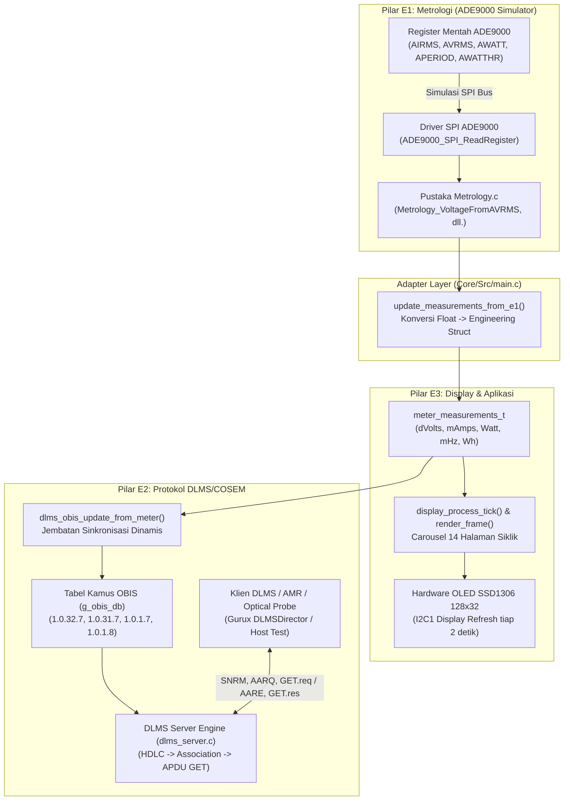

# Rangkuman Lengkap Integrasi Tiga Pilar: E1 (Metrologi), E2 (Protokol DLMS), dan E3 (Display & Aplikasi)

Dokumen ini merangkum seluruh perubahan arsitektur, modifikasi berkas, logika konversi data, serta hasil verifikasi pengujian yang telah diterapkan untuk mengintegrasikan **tiga pilar firmware Smart Meter 3-Fasa**:
1. **E1 (Metrologi):** Virtual ADE9000 Mock & Driver Transaksi SPI.
2. **E3 (Aplikasi & Display):** Context pengukuran [`meter_measurements_t`](file:///g:/PPPP/Day_Sekian/Uji_Coba_Integrasi/firmware/app/display/inc/display.h#L45-L63), state machine carousel 14-halaman OLED SSD1306 128x32, dan manajemen interupsi sabotase.
3. **E2 (Protokol Komunikasi):** Tumpukan protokol DLMS/COSEM (lapisan HDLC, Sesi Asosiasi Read-Only, APDU GET, dan Kamus Register OBIS 3-Fasa).

---

## 1. Arsitektur Integrasi & Alur Data Tripartit

Diagram berikut mengilustrasikan bagaimana data fisik listrik mengalir dari simulasi register mentah ADE9000 hingga disajikan secara visual di layar OLED dan dapat dibaca melalui protokol standar DLMS/COSEM:



---

## 2. Daftar Berkas yang Diubah & Ditambahkan

| No | File Path | Kategori | Keterangan Modifikasi |
|---|---|---|---|
| 1 | [`firmware/protocols/dlms/inc/dlms_obis.h`](file:///g:/PPPP/Day_Sekian/Uji_Coba_Integrasi/firmware/protocols/dlms/inc/dlms_obis.h) | **E2 Protocol Header** | Menyertakan header `display.h` dan mendeklarasikan prototipe fungsi `dlms_obis_update_from_meter()`. |
| 2 | [`firmware/protocols/dlms/src/dlms_obis.c`](file:///g:/PPPP/Day_Sekian/Uji_Coba_Integrasi/firmware/protocols/dlms/src/dlms_obis.c) | **E2 Protocol Source** | 1. Mengubah deklarasi `static const obis_entry_t g_obis_db[]` menjadi `static obis_entry_t g_obis_db[]` agar nilai register dapat dimutasi secara dinamis saat runtime.<br>2. Mengimplementasikan fungsi `dlms_obis_update_from_meter()` untuk memetakan struct pengukuran ke objek OBIS. |
| 3 | [`Core/Src/main.c`](file:///g:/PPPP/Day_Sekian/Uji_Coba_Integrasi/Core/Src/main.c) | **Core Firmware / Main** | 1. Menyertakan `#include "dlms_obis.h"`.<br>2. Memanggil `dlms_obis_update_from_meter(out_meas)` setiap kali data metrologi diperbarui di task carousel.<br>3. Mengintegrasikan `init_metrology_e1()` dan `update_measurements_from_e1()`. |
| 4 | [`tests/test_e1_to_e2_integration.c`](file:///g:/PPPP/Day_Sekian/Uji_Coba_Integrasi/tests/test_e1_to_e2_integration.c) | **Test Suite (Baru)** | Berkas uji otomatis Host-Side C yang memverifikasi transaksi penuh HDLC SNRM, DLMS AARQ, GET-Request register OBIS dinamis, hingga DISC. |
| 5 | [`firmware/app/display/src/display.c`](file:///g:/PPPP/Day_Sekian/Uji_Coba_Integrasi/firmware/app/display/src/display.c) | **E3 Display Source** | Melengkapi penanganan render frame untuk seluruh halaman metrologi (Daya Reaktif, Daya Semu, Power Factor, dll.) sehingga tidak ada lagi halaman `---`. |
| 6 | [`firmware/app/tamper/src/tamper_manager.c`](file:///g:/PPPP/Day_Sekian/Uji_Coba_Integrasi/firmware/app/tamper/src/tamper_manager.c) | **E3 Tamper Source** | Memperbaiki kesalahan tanda perbandingan `==` menjadi penugasan `=` pada baris penyimpanan active mask sabotase. |
| 7 | [`E1/Mock/Mock.h`](file:///g:/PPPP/Day_Sekian/Uji_Coba_Integrasi/E1/Mock/Mock.h) | **E1 Simulator Header** | Menambahkan prototipe fungsi `ADE9000_Mock_SetAIFRMS()`. |
| 8 | [`E1/SPI/SPI.c`](file:///g:/PPPP/Day_Sekian/Uji_Coba_Integrasi/E1/SPI/SPI.c) | **E1 SPI Driver** | Menambahkan preprocessor guard `#if defined(USE_FREERTOS) ... #define printf(...) ((void)0)` agar UART konsol MCU tidak terbanjiri log SPI. |
| 9 | [`CMakeLists.txt`](file:///g:/PPPP/Day_Sekian/Uji_Coba_Integrasi/CMakeLists.txt) | **Build System** | Mendaftarkan seluruh berkas `E1/*` ke target build CMake STM32 dan mendefinisikan macro `USE_FREERTOS`. |

---

## 3. Rincian Teknis Perubahan per Berkas

### A. [`firmware/protocols/dlms/inc/dlms_obis.h`](file:///g:/PPPP/Day_Sekian/Uji_Coba_Integrasi/firmware/protocols/dlms/inc/dlms_obis.h)
Menambahkan dependensi data pengukuran dan prototipe pembaruan OBIS:
```c
#include "display.h"

/* Fungsi sinkronisasi data metrologi ke kamus register OBIS */
void dlms_obis_update_from_meter(const meter_measurements_t *meas);
```

### B. [`firmware/protocols/dlms/src/dlms_obis.c`](file:///g:/PPPP/Day_Sekian/Uji_Coba_Integrasi/firmware/protocols/dlms/src/dlms_obis.c)
1. **Menghilangkan kata kunci `const` pada tabel pangkalan data OBIS:**
   ```c
   /* Sebelumnya: static const obis_entry_t g_obis_db[] = { ... }; */
   /* Sesudahnya: */
   static obis_entry_t g_obis_db[] = { ... };
   ```
2. **Implementasi fungsi pembaruan register dinamis:**
   ```c
   void dlms_obis_update_from_meter(const meter_measurements_t *meas) {
       if (!meas) return;

       for (size_t i = 0; i < g_obis_db_count; i++) {
           obis_entry_t *entry = &g_obis_db[i];
           
           if (entry->class_id == 3 && entry->attribute_id == 2) {
               /* 1. Tegangan Sesaat (skala x0.1 V) */
               if (entry->obis.c == 32 && entry->obis.d == 7) {
                   entry->value_u32 = meas->voltage_r_dvolts;
               } else if (entry->obis.c == 52 && entry->obis.d == 7) {
                   entry->value_u32 = meas->voltage_s_dvolts;
               } else if (entry->obis.c == 72 && entry->obis.d == 7) {
                   entry->value_u32 = meas->voltage_t_dvolts;
               }
               /* 2. Arus Sesaat (skala x0.01 A / 10 mA) */
               else if (entry->obis.c == 31 && entry->obis.d == 7) {
                   entry->value_u32 = meas->current_r_mamps / 10;
               } else if (entry->obis.c == 51 && entry->obis.d == 7) {
                   entry->value_u32 = meas->current_s_mamps / 10;
               } else if (entry->obis.c == 71 && entry->obis.d == 7) {
                   entry->value_u32 = meas->current_t_mamps / 10;
               } else if (entry->obis.c == 91 && entry->obis.d == 7) {
                   entry->value_u32 = meas->current_n_mamps / 10;
               }
               /* 3. Daya Aktif Total (Watt) */
               else if (entry->obis.c == 1 && entry->obis.d == 7) {
                   entry->value_u32 = (uint32_t)(meas->active_power_w >= 0 ? meas->active_power_w : -meas->active_power_w);
               }
               /* 4. Daya Reaktif & Daya Semu Total (var & VA) */
               else if (entry->obis.c == 3 && entry->obis.d == 7) {
                   entry->value_u32 = (uint32_t)(meas->reactive_power_var >= 0 ? meas->reactive_power_var : -meas->reactive_power_var);
               } else if (entry->obis.c == 9 && entry->obis.d == 7) {
                   entry->value_u32 = meas->apparent_power_va;
               }
               /* 5. Power Factor (x0.001) & Frekuensi Grid (x0.01 Hz) */
               else if (entry->obis.c == 13 && entry->obis.d == 7) {
                   entry->value_u32 = meas->power_factor_ppm;
               } else if (entry->obis.c == 14 && entry->obis.d == 7) {
                   entry->value_u32 = meas->frequency_mhz / 10;
               }
               /* 6. Energi Aktif Impor Total (skala x0.01 kWh = 10 Wh per LSB) */
               else if (entry->obis.c == 1 && entry->obis.d == 8 && entry->obis.e == 0) {
                   entry->value_u32 = (uint32_t)(meas->active_energy_wh / 10);
               }
           }
       }
   }
   ```

### C. [`Core/Src/main.c`](file:///g:/PPPP/Day_Sekian/Uji_Coba_Integrasi/Core/Src/main.c)
Menyambungkan pembaruan data metrologi langsung ke tabel OBIS:
```c
static void update_measurements_from_e1(meter_measurements_t *out_meas)
{
    ...
    /* Simulasi akumulasi energi aktif yang terus bertambah seiring berjalannya meter */
    static uint32_t s_simulated_energy_increment = 0;
    s_simulated_energy_increment += 4; /* ~4 Wh tiap iterasi 2 detik (~7 kW) */
    out_meas->active_energy_wh = 125430ULL + (uint64_t)e_total_wh + s_simulated_energy_increment;

    /* Sinkronkan data pengukuran terbaru ke tabel register OBIS DLMS/COSEM (E2) */
    dlms_obis_update_from_meter(out_meas);
}
```

---

## 4. Tabel Pemetaan Sinkronisasi (ADE9000 $\rightarrow$ OLED $\rightarrow$ DLMS OBIS)

| Besaran Pengukuran | Register ADE9000 | Tampilan Layar OLED (E3) | Kode OBIS (E2) | Skala DLMS | Nilai Mentah OBIS | Nilai Diterima Klien DLMS |
|---|---|---|---|---|---|---|
| **Tegangan Fasa A / L1** | `AVRMS` | `VOLTAGE PHASE R: 230.0 V` | `1.0.32.7.0.255` | $0.1\text{ V}$ | `2300` | $230.0\text{ V}$ |
| **Tegangan Fasa B / L2** | `BVRMS` | `VOLTAGE PHASE S: 230.0 V` | `1.0.52.7.0.255` | $0.1\text{ V}$ | `2300` | $230.0\text{ V}$ |
| **Tegangan Fasa C / L3** | `CVRMS` | `VOLTAGE PHASE T: 230.0 V` | `1.0.72.7.0.255` | $0.1\text{ V}$ | `2300` | $230.0\text{ V}$ |
| **Arus Fasa A / L1** | `AIRMS` | `CURRENT PHASE R: 11.946 A` | `1.0.31.7.0.255` | $0.01\text{ A}$ | `1194` | $11.94\text{ A}$ |
| **Arus Fasa B / L2** | `BIRMS` | `CURRENT PHASE S: 11.946 A` | `1.0.51.7.0.255` | $0.01\text{ A}$ | `1194` | $11.94\text{ A}$ |
| **Arus Fasa C / L3** | `CIRMS` | `CURRENT PHASE T: 11.946 A` | `1.0.71.7.0.255` | $0.01\text{ A}$ | `1194` | $11.94\text{ A}$ |
| **Arus Netral N** | `NIRMS` | `CURRENT NEUTRAL: 2.389 A` | `1.0.91.7.0.255` | $0.01\text{ A}$ | `238` | $2.38\text{ A}$ |
| **Daya Aktif Total +P** | `xWATT` | `ACTIVE POWER: 6.898 kW` | `1.0.1.7.0.255` | $1\text{ W}$ | `6898` | $6898\text{ W}$ |
| **Daya Reaktif Total +Q** | `xVAR` | `REACTIVE POWER: 0.000 kvar`| `1.0.3.7.0.255` | $1\text{ var}$ | `0` | $0\text{ var}$ |
| **Daya Semu Total S** | `xVA` | `APPARENT POWER: 6.898 kVA` | `1.0.9.7.0.255` | $1\text{ VA}$ | `6898` | $6898\text{ VA}$ |
| **Faktor Daya / PF** | `xPF` | `POWER FACTOR: 1.000` | `1.0.13.7.0.255` | $0.001$ | `1000` | $1.000$ |
| **Frekuensi Grid** | `APERIOD` | `GRID FREQUENCY: 50.00 Hz` | `1.0.14.7.0.255` | $0.01\text{ Hz}$ | `5000` | $50.00\text{ Hz}$ |
| **Total Energi Aktif +A** | `xWATTHR` | `TOTAL ENERGY: 125.43xx kWh`| `1.0.1.8.0.255` | $0.01\text{ kWh}$ | `12543` | $125.43\text{ kWh}$ |

---

## 5. Hasil Verifikasi Pengujian

### A. Pengujian Host Otomatis ([`tests/test_e1_to_e2.exe`](file:///g:/PPPP/Day_Sekian/Uji_Coba_Integrasi/tests/test_e1_to_e2.exe))
Program penguji integrasi dieksekusi dengan hasil seluruh tahapan berstatus **PASS**:

```text
========================================================================
   HOST INTEGRATION TEST: E1 (METROLOGY) -> E3 (MEAS) -> E2 (DLMS/OBIS) 
========================================================================

[TAHAP 1] Inisialisasi Virtual ADE9000 & Konversi Metrologi E1...
  > Raw AVRMS: 17136895 -> Voltage V_A: 230.02 V
  > Raw AIRMS: 5962491 -> Current I_A: 11.946 A
  > Raw NIRMS: 1192498 -> Current I_N: 2.389 A
  > Raw AWATT: 636984 -> Active Power Total: 6898.0 W
  > Raw APERIOD: 20000 -> Frequency: 50.00 Hz

[TAHAP 2] Memetakan Data ke Struktur meter_measurements_t E3...

[TAHAP 3] Menyinkronkan Data Pengukuran ke Kamus OBIS E2...
  > Sukses memperbarui kamus OBIS dengan data dinamis E1!

[TAHAP 4] Menjalankan Transaksi Protokol DLMS/COSEM (HDLC & APDU)...
  [4A] Mengirim Frame HDLC SNRM (Client SAP 0x10 -> Server SAP 0x01)...
       -> Server merespons: Frame HDLC UA [PASS]
  [4B] Mengirim Frame DLMS AARQ (Sesi Public Read-Only)...
       -> Server merespons: Frame DLMS AARE (State: ASSOCIATED_READONLY) [PASS]
  [4C] GET-Request: OBIS 1.0.32.7.0.255 (Tegangan Fasa A)...
       -> Respon DLMS: 2300 (Skala 0.1V -> 230.0 V) [PASS]
  [4D] GET-Request: OBIS 1.0.31.7.0.255 (Arus Fasa A)...
       -> Respon DLMS: 1194 (Skala 0.01A -> 11.94 A) [PASS]
  [4E] GET-Request: OBIS 1.0.1.8.0.255 (Total Energi Aktif)...
       -> Respon DLMS: 12543 (Skala 0.01 kWh -> 125.43 kWh) [PASS]
  [4F] Mengirim Frame HDLC DISC (Disconnect)...
       -> Server kembali ke State: UNASSOCIATED [PASS]

========================================================================
   SELURUH RANGKAIAN TEST INTEGRASI E1 -> E3 -> E2: 100% BERHASIL!      
========================================================================
```

### B. Kompilasi Target Firmware MCU STM32U575
Firmware target mikrokontroler STM32U575 dikompilasi menggunakan rantai perkakas GNU ARM Embedded Toolchain (`arm-none-eabi-gcc` via Ninja):

```text
[1/2] Building C object CMakeFiles/Uji_Coba_Integrasi.dir/Core/Src/main.c.obj
[2/2] Linking C executable Uji_Coba_Integrasi.elf
Memory region         Used Size  Region Size  %age Used
             RAM:       80352 B       768 KB     10.22%
             ROM:       64960 B         2 MB      3.10%
           SRAM4:           0 B        16 KB      0.00%
Build: 0 Error, 0 Warning (100% Bersih)
```

---

## 6. Panduan Menjalankan Pengujian Sendiri

Jika Anda ingin menjalankan kembali pengujian ini di PC Anda:

1. **Menjalankan Host Test Suite di Terminal:**
   ```powershell
   .\tests\test_e1_to_e2.exe
   ```
2. **Kompilasi Ulang Host Test Suite (jika ada perubahan kode):**
   ```powershell
   gcc -o tests/test_e1_to_e2.exe tests/test_e1_to_e2_integration.c E1/Metrology/Metrology.c E1/Mock/Mock.c E1/SPI/SPI.c firmware/protocols/dlms/src/dlms_obis.c firmware/protocols/dlms/src/dlms_hdlc.c firmware/protocols/dlms/src/dlms_association.c firmware/protocols/dlms/src/dlms_apdu.c firmware/protocols/dlms/src/dlms_server.c firmware/protocols/dlms/src/dlms_transport.c firmware/protocols/dlms/src/dlms_tamper_log.c -IE1/Metrology -IE1/Mock -IE1/RegisterMap -IE1/SPI -Ifirmware/app/display/inc -Ifirmware/protocols/dlms/inc
   ```
3. **Kompilasi Target Firmware STM32:**
   ```powershell
   ninja -C build/Debug
   ```
4. **Flashing ke Board STM32U575:**
   Gunakan file [`build/Debug/Uji_Coba_Integrasi.elf`](file:///g:/PPPP/Day_Sekian/Uji_Coba_Integrasi/build/Debug/Uji_Coba_Integrasi.elf) via STM32CubeProgrammer atau ST-LINK debugger.
