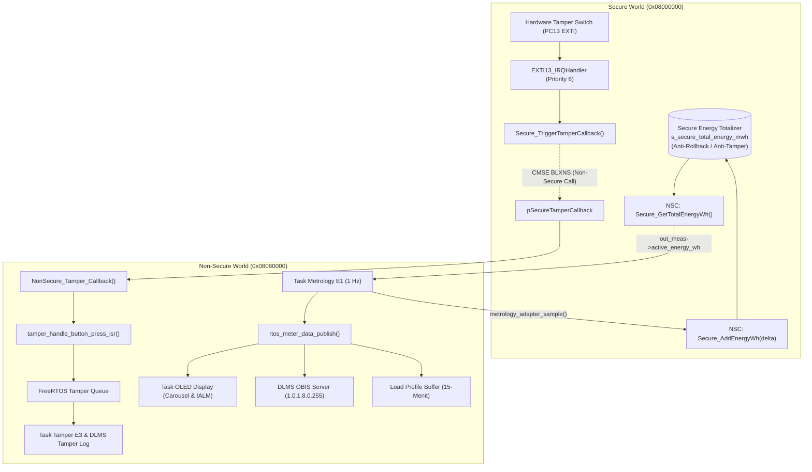

# Rangkuman Integrasi STM32U575 TrustZone & Ekspektasi Output Hardware

Dokumen ini merangkum seluruh arsitektur integrasi **ARM Cortex-M33 TrustZone** pada mikrokontroler **STM32U575VGT6** untuk meteran listrik 3-fasa tipe **Pascabayar (Post-Paid)** sesuai standar **SPLN D3.006:2021**, serta rincian output yang diekspektasikan pada terminal **UART (LPUART1)** dan layar **OLED (SSD1306 128x32)**.

---

## 1. Arsitektur Pemisahan TrustZone (Secure vs Non-Secure)

| Komponen / Periferal | Domain | Alasan Keamanan & Peran Sistem |
| :--- | :---: | :--- |
| **PC13 (Tamper Case Open)** | **Secure** | Saklar fisik deteksi pembongkaran penutup meteran. Dikonfigurasi dengan atribut `EXTI_LINE_SEC` agar tidak bisa di-bypass atau di-disable oleh kode aplikasi di Non-Secure. |
| **Secure Energy Totalizer** | **Secure** | Register billing akumulasi energi aktif kumulatif (Wh/mWh). Mencegah manipulasi angka kWh, buffer overflow, maupun rollback saldo pemakaian pascabayar. |
| **GTZC / MPCBB & SAU** | **Secure** | Konfigurasi isolasi memori Flash, SRAM, dan register periferal. |
| **FreeRTOS Kernel** | **Non-Secure** | Port `ARM_CM33_NTZ` (Non-TrustZone FreeRTOS). Menjadwalkan multi-tasking aplikasi meteran di User/Privileged Non-Secure mode. |
| **LPUART1 (PA2/PA3 @ 115200)** | **Non-Secure** | Port komunikasi universal (Konsol diagnostik sistem dan komunikasi optik DLMS/COSEM HDLC). |
| **I2C1 (PB8/PB9 @ 400 kHz)** | **Non-Secure** | Antarmuka display OLED SSD1306 untuk visualisasi carousel informasi pelanggan. |
| **E1 Metrology ADE9000 & Adapter** | **Non-Secure** | Sampling pengukuran fasa R, S, T, dan Netral. Menyetorkan penambahan Wh ke Secure World via NSC. |
| **E2 DLMS/COSEM Engine** | **Non-Secure** | Pengelola asosiasi HDLC, parsing AARQ/AARE, dan pembacaan kamus OBIS 150+ parameter. |
| **E3 Display, Tamper & Profiling** | **Non-Secure** | Tasking UI, snapshot load profile 15-menit ke NVRAM, serta State Machine meteran. |



---

## 2. Rincian NSC (Non-Secure Callable) Gateway

Semua fungsi di bawah ini diekspor melalui pustaka import `Secure_nsclib/secure_nsclib.o` dan dapat dipanggil langsung dari kode Non-Secure:

1. **`SECURE_RegisterCallback(SECURE_CallbackIDTypeDef CallbackId, void *func)`**
   * Mendaftarkan fungsi callback dari Non-Secure.
   * `SECURE_TAMPER_CB_ID (0x02U)`: Menghubungkan interupsi sabotase PC13 ke `NonSecure_Tamper_Callback`.
2. **`Secure_AddEnergyWh(uint32_t delta_wh)`**
   * Menambahkan energi pemakaian kWh pascabayar secara terproteksi ke register Secure.
3. **`Secure_AddEnergyMilliWh(uint32_t delta_mwh)`**
   * Menambahkan akumulasi energi dengan resolusi tinggi (milli-Wh).
4. **`Secure_GetTotalEnergyWh(void)`**
   * Mengambil total kumulatif energi aktif (Wh) untuk data model E3 dan DLMS OBIS.
5. **`Secure_GetTotalEnergyMilliWh(void)`**
   * Membaca total kumulatif dalam milli-Wh.

---

## 3. Ekspektasi Output Saat Dijalankan pada Board VGT

### A. Output Serial UART (LPUART1 pada PA2 / PA3 @ 115200 bps, 8N1)

Buka serial terminal (PuTTY / Tera Term / ST-Link VCP) pada baud rate **115200 bps**:

#### 1. Saat Pertama Kali Boot (Power-On Reset):
```text
================================================================================
   STM32U575 TRUSTZONE SMART METER INITIALIZED
   Universal Console Driver (E3 Platform)
   Hardware Port: LPUART1 (PA2/PA3 @ 115200 bps)
   System Clock : 160 MHz (PLL Boost Mode)
   Metrology E1 : ADE9000 Mock & RegisterMap
   Protocol  E2 : DLMS/COSEM HDLC Server
   Security  TZ : ARM Cortex-M33 TrustZone Enabled
================================================================================
[RTOS] Memulai FreeRTOS Scheduler...
[METROLOGY] Task started. Sampling: 1000 ms. Profiling: 15 menit.
[DLMS] Server Task Started. HDLC Ready.
```

#### 2. Saat Tombol Sabotase PC13 Ditekan (Simulasi Tutup Meter Dibuka):
Interupsi Secure EXTI13 langsung menembus isolasi TrustZone dan mentransfer kejadian ke FreeRTOS queue Non-Secure:
```text
[TAMPER] *** DARURAT! SABOTASE TERDETEKSI (CASE OPEN) ***
```

#### 3. Saat Tombol Sabotase PC13 Dilepas / Saklar Tertutup Kembali:
```text
[TAMPER] Sabotase dipulihkan. Sistem kembali normal.
```

#### 4. Setiap Interval 15 Menit (Load Profile Snapshot):
```text
[PROFILE] Snapshot profil beban 15-menit berhasil dibekukan.
```

---

### B. Output Layar OLED (SSD1306 128x32 pada I2C1 PB8/PB9)

Layar beroperasi dalam **Carousel Mode Otomatis** sesuai standar SPLN D3.006:2021 Gambar 4:

#### 1. Layar Awal Saat Booting (Boot Screen):
```text
+------------------------+
|    STM32U575 START     |
|    Booting RTOS...     |
+------------------------+
```

#### 2. Siklus Carousel Normal (Berganti Tiap Beberapa Detik):

* **Halaman 01: Identitas Pelanggan (IDPEL - OBIS 96.01)**
  ```text
  +------------------------+
  | OK                  01 |
  | ID PELANGGAN           |
  | 530000000001           |
  | OBIS: 96.01            |
  +------------------------+
  ```

* **Halaman 02: Tegangan Fasa R (OBIS 32.07)**
  ```text
  +------------------------+
  | OK                  02 |
  | VOLTAGE PHASE R        |
  | 230.0 V                |
  | OBIS: 32.07            |
  +------------------------+
  ```

* **Halaman 03: Arus Fasa R (OBIS 31.07)**
  ```text
  +------------------------+
  | OK                  03 |
  | CURRENT PHASE R        |
  | 11.946 A               |
  | OBIS: 31.07            |
  +------------------------+
  ```

* **Halaman 09: Frekuensi Grid (OBIS 14.07)**
  ```text
  +------------------------+
  | OK                  09 |
  | GRID FREQUENCY         |
  | 50.00 Hz               |
  | OBIS: 14.07            |
  +------------------------+
  ```

* **Halaman 11: Total Energi Aktif Pascabayar (Secure Totalizer - OBIS 01.08)**
  ```text
  +------------------------+
  | OK                  11 |
  | TOTAL ENERGY           |
  | 125.4340 kWh           |
  | OBIS: 01.08            |
  +------------------------+
  ```
  *(Angka `125.4340 kWh` ini bersumber dari Secure World dan bertambah ~4 Wh secara berkala)*.

#### 3. Tampilan Saat Sabotase Kasus Tutup Meter Dibuka (PC13 Ditekan):
Display akan **seketika beralih secara instan** menampilkan banner alarm darurat tanpa menunggu giliran carousel:
```text
+------------------------+
| !ALM                AL |
| STATUS SABOTASE        |
| RUSAK                  |
| OBIS: 96.50            |
+------------------------+
```
> [!IMPORTANT]
> Sesuai **SPLN D3.006:2021 Tabel 6 No 1**:
> * Indikator Header: `!ALM` (Status Darurat Sabotase)
> * Nomor Halaman: `AL` (Alarm Page)
> * Teks Layar: `RUSAK`
> * Kode Error: `-` (Tidak ada kode numerik, langsung menampilkan status `RUSAK`)
> * Objek OBIS: `0.0.96.50.0.255` (Tamper Event Register)

---

### C. Respon Komunikasi Optik / Serial DLMS COSEM (E2)

Jika PC atau modem meteran mengirimkan frame DLMS HDLC melalui LPUART1:
* **SNRM Frame (`7E A0 07 03 21 93 0F 01 7E`)**:
  * Board merespons dengan frame **UA** (`7E A0 1F 21 03 73 ... 7E`).
* **AARQ Frame (Koneksi Asosiasi Client Public)**:
  * Board merespons dengan frame **AARE** (State berubah menjadi `ASSOCIATED_READONLY`).
* **GET-Request OBIS `1.0.1.8.0.255` (Active Import Energy)**:
  * Mengembalikan data register total energi pascabayar yang diambil dari `Secure_GetTotalEnergyWh()`.
* **GET-Request OBIS `0.0.99.98.0.255` (Tamper Log Profile)**:
  * Mengembalikan riwayat log sabotase yang mencatat waktu dan kode kejadian saat tombol PC13 ditekan.

---

## 4. Panduan Flash ke Hardware Board VGT

Untuk memprogram mikrokontroler STM32U575:
1. Pastikan Option Byte **TZEN=1** (TrustZone Enable) telah aktif di STM32CubeProgrammer.
2. Flash file binary **Secure** terlebih dahulu:
   * File: `build/Debug/Secure/Uji_Coba_Integrasi_TZ_S.elf`
   * Target Address: `0x08000000` (Bank 1 Flash)
3. Flash file binary **Non-Secure**:
   * File: `build/Debug/NonSecure/Uji_Coba_Integrasi_TZ_NS.elf`
   * Target Address: `0x08080000` (Bank 2 Flash)
4. Tekan tombol **RESET (B2)** pada board. Sistem akan langsung menjalankan banner serial dan siklus OLED di atas.

